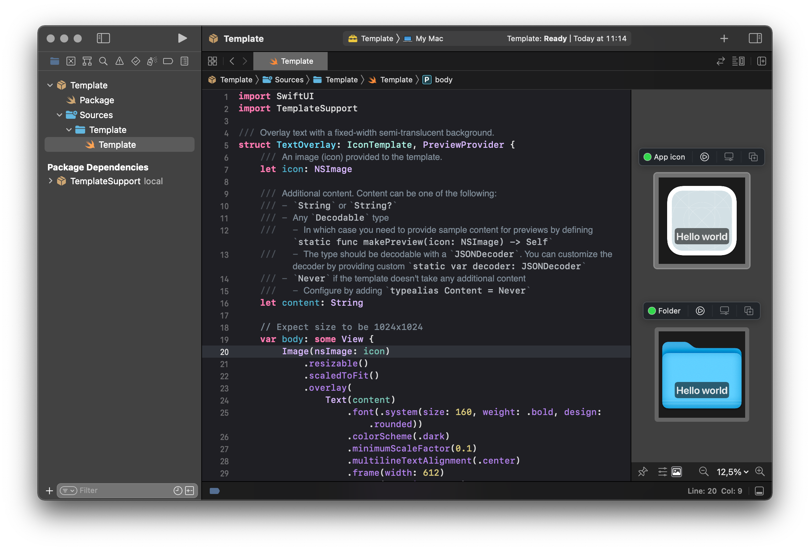

<p align=center></p>

# NewIcon

NewIcon is a command line tool to modify and manage icons for applicatons, files, and directories on macOS.

### Features

- A quick way to overlay some text over an icon 
- Reset to the original icon
- Use any SwiftUI View as a template

## Installation

Install using [Mint](https://github.com/yonaskolb/Mint).
```sh
$ mint install auramagi/NewIcon
```

## Usage

### Overlay text over the original icon
```sh
$ new-icon text FILE TEXT

# Add version number to Xcode app icon
$ new-icon text /Applications/Xcode.app 13.4.1
```
  - Tip: when changing Xcode icon, don't forget about the Simulator icon! It's located inside the Xcode bundle: `/Applications/Xcode.app/Contents/Developer/Applications/Simulator.app`

### Revert an icon to the original
```sh
$ new-icon reset FILE
```

## Usage with SwiftUI template files

### Use a SwiftUI template to modify an icon
```sh
$ new-icon template icon TEMPLATE FILE CONTENT
```

See [SampleTemplates folder](./SampleTemplates) for some inspiration.

| File | Command | Output |
|:--|:--|---|
| [NewHue.swift](./SampleTemplates/NewHue.swift) | `new-icon template icon NewHue.swift /Applications/Xcode.app mint` |  |
| [Trash.swift](./SampleTemplates/Trash.swift) | `new-icon template icon Trash.swift /Applications/Xcode.app` |  |
 
### Create a sample template file

If you need a place to start with writing your own SwiftUI template files, run this command to get a sample template.

```sh
$ new-icon template init
```

### Open a template file in Xcode

NewIcon allows you to edit a template file with Xcode by creating and opening a temporary SwiftPM package. Edit `Template/Sources/Template/Template.swift` inside, and any changes will be synced to the original file. After you are done editing close Xcode and press return to delete this temporary package. 

```sh
$ new-icon template edit TEMPLATE
```
  - Tip: Make sure `My Mac` is selected as build destination.



### Clear build cache for templates

Template files need to be built before they can be used. At the very least, this takes several seconds, so NewIcon caches build products inside `~/.new-icon/cache` to speed up any subsequent use of the same template. There is a simple command to clear this cache.

```sh
$ new-icon template cache clear
```

## Detailed command info

Run `new-icon help` to see all options.
